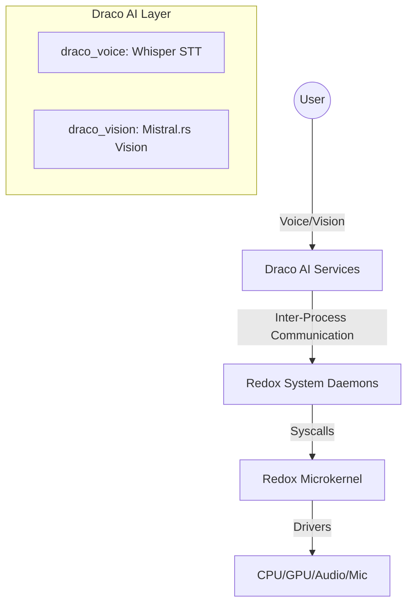

# Draco-OS

<p align="center">
  
  
  
  
</p>

**Draco-OS** is a next-generation, AI-first microkernel operating system. Built as a sophisticated fork of [Redox OS](https://redox-os.org), Draco-OS integrates advanced AI capabilities directly into the system architecture, enabling a seamless, voice-dictated, and vision-aware computing experience.

> [!IMPORTANT]
> Draco-OS is currently in **early experimental stage**. It is designed for researchers, AI enthusiasts, and system developers who want to explore the frontier of AI-native operating systems.

---

## Core Philosophy

Traditional operating systems treat AI as an application. Draco-OS treats AI as a **core system service**. 

*   **Voice-Native**: Controlled primarily through natural language. No more typing complex shell commands.
*   **Context-Aware**: The system "sees" what you see, providing real-time code optimizations and workflow assistance.
*   **Privacy-First**: All AI processing (STT, Vision, LLM) runs **locally** on your hardware using `whisper-rs` and `mistral.rs`. No cloud API calls, no data leaks.
*   **Microkernel Security**: Inherits the memory safety and modularity of the Redox microkernel, written entirely in Rust.

---

## Key Features

- **Zero-Touch Interface**: Wake-word detection ("Draco") with ultra-low latency (<500ms).
- **Visual Intelligence**: Real-time framebuffer analysis for context-aware developer assistance.
- **Pure Rust Stack**: From the kernel to the AI daemons, the entire system leverages Rust's safety guarantees.
- **Modular Services**: AI capabilities are isolated in user-space daemons, ensuring kernel stability.
- **High Performance**: Optimized for modern x86_64 architecture with planned ARM support.

---

## System Architecture



### Technical Stack
*   **Kernel**: Redox Microkernel (MIT)
*   **Filesystem**: RedoxFS
*   **GUI**: Orbital Window Manager
*   **Shell**: Ion Shell (enhanced with `draco://` protocol)
*   **AI Engine**: `whisper-rs` (Voice) & `mistral.rs` (Vision)

---

## Quick Start

### 1. Prerequisites (Ubuntu/Debian/Pop!_OS)
Ensure you have the necessary build tools and Rust nightly environment:

```bash
sudo apt update && sudo apt install -y \
  build-essential git curl clang llvm nasm xorriso grub-pc-bin qemu-system-x86

# Setup Rust Nightly
rustup default nightly
rustup component add rust-src rustfmt clippy
rustup target add x86_64-unknown-redox
```

### 2. Build and Boot
Clone the repository and launch the system in QEMU:

```bash
git clone https://github.com/XplnHUB/Draco-OS.git
cd draco-os
make qemu
```

Once booted, type `draco_voice &` in the terminal to initialize the AI listener.

---

## Development Roadmap

| Phase | Milestone | Description | Status |
| :--- | :--- | :--- | :--- |
| Phase 1 | Foundational Voice | Wake-word detection + basic STT command execution. | Done |
| Phase 2 | Contextual Vision | Framebuffer capture + Mistral.rs vision integration. | In Progress |
| Phase 3 | Neural Optimization | Real-time code refactoring agents within the IDE. | Planned |
| Phase 4 | Hardware Expansion | Native support for Raspberry Pi 5 and ARM64. | Planned |

---

## Contributing

We welcome contributions from the community! Whether it's improving the kernel, optimizing AI models, or enhancing hardware support.

1.  **Fork** the repository.
2.  **Create** your feature branch (`git checkout -b feature/amazing-feature`).
3.  **Commit** your changes (`git commit -m 'Add amazing feature'`).
4.  **Push** to the branch (`git push origin feature/amazing-feature`).
5.  **Open** a Pull Request.

---

## License & Credits

Distributed under the MIT License. See `LICENSE` for more information.

*   **Redox OS**: Special thanks to the [Redox OS team](https://redox-os.org) for the incredible foundation.
*   **AI Libraries**: Powered by `whisper-rs` and `mistral.rs`.

---

<p align="center">
  Built with heart by Arpit Sarang and the Draco-OS Community.
  <br>
  <i>"Say 'Draco' to wake the future of operating systems."</i>
</p>