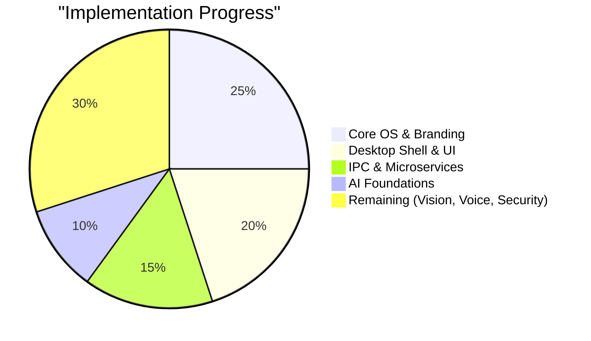

# 🐉 Draco-OS: The Journey to a Proper OS

This document tracks the evolution of **Draco-OS**, a privacy-first, AI-native operating system built on the Redox microkernel. It outlines our current standing, what’s ready for use, and the road ahead to becoming a fully realized "proper" operating system.

---

## 📊 Current Progress Overview

We have successfully laid the foundation. The "skeleton" of the OS is alive, breathing, and branded. We are now moving from **Infrastructure** to **Intelligence**.

---

## ✅ What's Implemented (The Foundation)

### 1. Core OS & Identity
- [x] **Redox Kernel Base**: Stable microkernel architecture inherited and optimized.
- [x] **Draco Branding**: System-wide rebranding (Bootloader, Kernel logs, ASCII art).
- [x] **Build System**: Robust `Makefile` and Rust toolchain configuration for `x86_64-unknown-redox`.
- [x] **Relibc Stability**: Critical fixes implemented in the C library to support modern Rust binaries.
- [x] **User Identity**: Initial structures for the primary user and auto-login mechanisms.

### 2. Desktop Environment (`draco_shell`)
- [x] **Custom Shell**: A lightweight, Rust-based desktop environment replacing the default Cosmic UI.
- [x] **Status Bar**: Real-time system monitoring (CPU, RAM, Battery, Network).
- [x] **App Launcher**: Logic for mapping and launching system applications.
- [x] **Teal/Orange Aesthetics**: Initial implementation of the "Pop-style" modern theme with rounded corners.

### 3. AI & Service Architecture
- [x] **Microservice Blueprint**: Modular design with `draco_core`, `voice`, `vision`, and `face`.
- [x] **IPC Backbone**: Communication protocol allowing services to talk to each other safely.
- [x] **Local AI Integration**: `whisper-rs` (Speech-to-Text) and `mistral.rs` (Vision/LLM) integrated into the build-std process.

---

## 🚀 The Remaining Journey (Towards a "Proper OS")

To reach a "Daily Driver" status, we are actively working on the following phases:

### 🔊 Phase A: The Voice-First Interface
- [ ] **Always-On Wake Word**: Reliable "Draco" detection with <500ms latency.
- [ ] **NLP Command Parser**: Turning "Open Firefox" or "Show my RAM" into executable OS actions.
- [ ] **Audio Feedback**: System-wide sound effects and local TTS (Text-to-Speech) responses.

### 👁️ Phase B: Visual & Biometric Security
- [ ] **`draco_face`**: Local facial recognition for login and presence-based locking.
- [ ] **`draco_vision`**: Screen-aware processing. The OS should "see" your active windows to provide context.
- [ ] **Voice Biometrics**: Ensuring only your voice can execute sensitive commands like `reboot` or `delete`.

### 🛠️ Phase C: System Maturity & Polish
- [ ] **Advanced Power Management**: Sleep/Hibernate triggered by inactivity or low battery.
- [ ] **Unified Settings App**: A GUI to manage AI models, privacy levels, and appearance.
- [ ] **Hardware Expansion**: Moving beyond QEMU to native hardware support (starting with ThinkPads and Pi 5).

---

## 📉 Summary of Completion

| Category | Status | Completion % |
| :--- | :--- | :--- |
| **Kernel & Boot** | 🟢 Stable | 95% |
| **Branding & Identity** | 🟢 Done | 100% |
| **Desktop UI (Shell)** | 🟡 Functional | 60% |
| **IPC & Framework** | 🟡 Functional | 75% |
| **Voice Interaction** | 🟠 Experimental | 20% |
| **Vision & Biometrics** | 🔴 Planned | 5% |
| **System Optimization**| 🔴 Planned | 10% |

---

## ⚡ Next Immediate Steps
1.  **Refine `draco_voice`**: Transition from manual launch to a background daemon with wake-word detection.
2.  **Implement `draco_face`**: Hook into the `orbital` window manager for biometric unlock.
3.  **Visual Polish**: Add animations to the `draco_shell` app launcher.

---
> "The future of computing isn't just about what you click, but what you say and what the system understands." 
> — *The Draco-OS Philosophy*

*Document updated: 2026-04-07*
